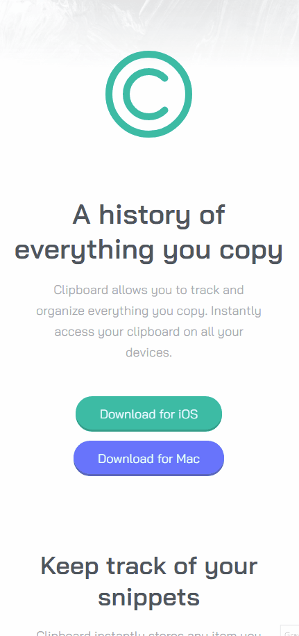

# README

Desafio em que pude praticar o flexbox e também em uma página responsiva.

<h2 align="center">
  
  
  <a href="https://clipboardsabrina.netlify.app/">Veja aqui o projeto</a>
</h2>

👽 Sabrina Suzuki

